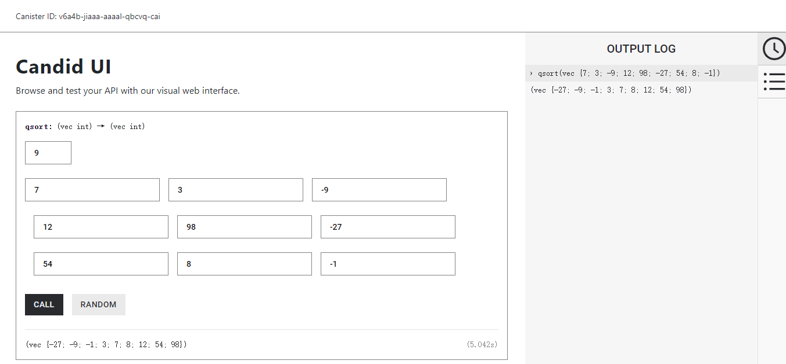

## 部署到主网

```bash
$ dfx deploy --network=ic --with-cycles=400000000000

Deploying all canisters.
Creating canisters...
Creating canister qsort_backend...
qsort_backend canister created on network ic with canister id: v6a4b-jiaaa-aaaal-qbcvq-cai
Creating canister qsort_frontend...
qsort_frontend canister created on network ic with canister id: vlhnm-iaaaa-aaaal-qbcwa-cai
Building canisters...
Installing canisters...
Installing code for canister qsort_backend, with canister ID v6a4b-jiaaa-aaaal-qbcvq-cai
Installing code for canister qsort_frontend, with canister ID vlhnm-iaaaa-aaaal-qbcwa-cai
Uploading assets to asset canister...
Starting batch.
Staging contents of new and changed assets:
  /sample-asset.txt 1/1 (24 bytes)
Committing batch.
Deployed canisters.
URLs:
  Backend canister via Candid interface:
    qsort_backend: https://a4gq6-oaaaa-aaaab-qaa4q-cai.raw.ic0.app/?id=v6a4b-jiaaa-aaaal-qbcvq-cai
```

## 使用主网的 Candid UI 调试运行

https://a4gq6-oaaaa-aaaab-qaa4q-cai.raw.ic0.app/?id=v6a4b-jiaaa-aaaal-qbcvq-cai

